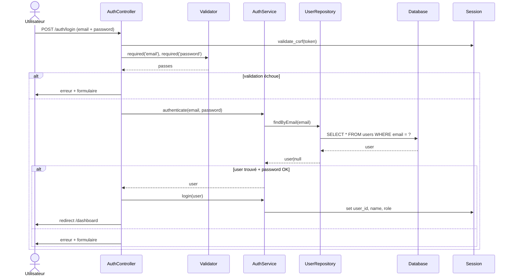
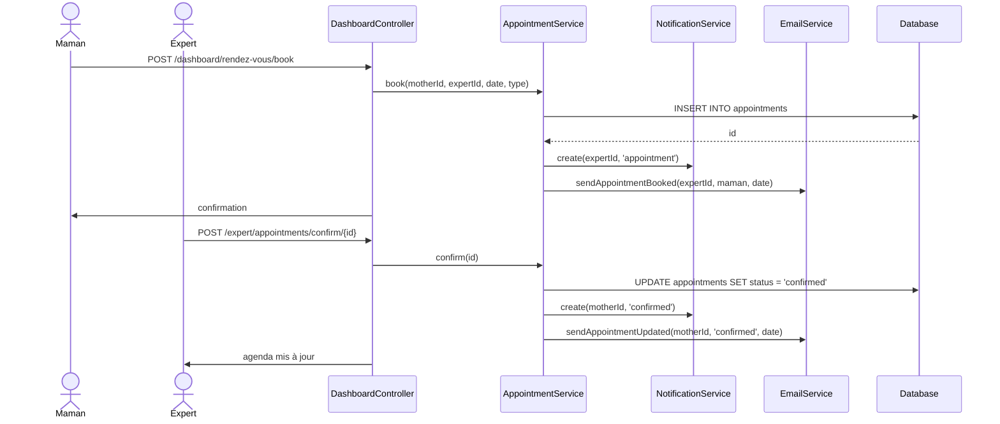
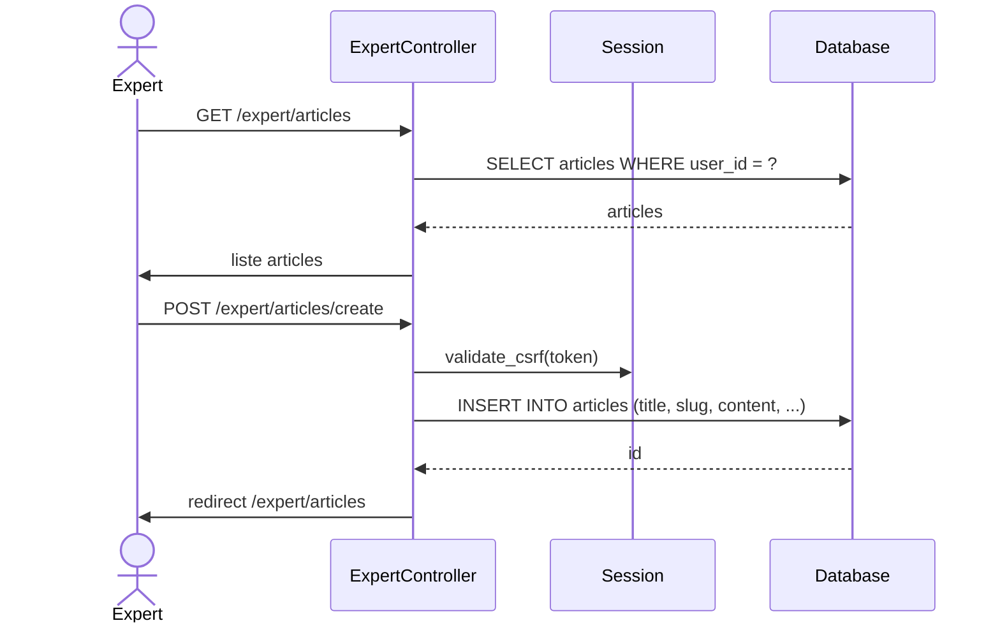
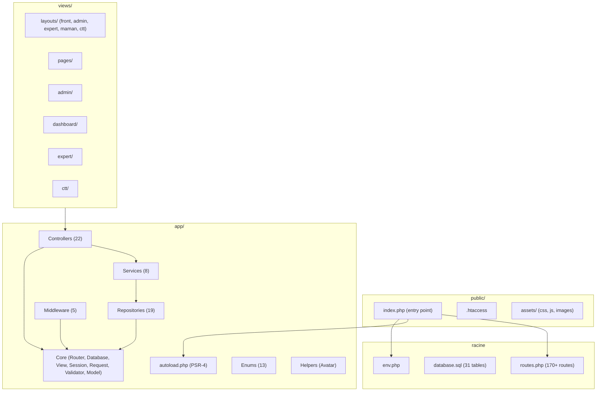
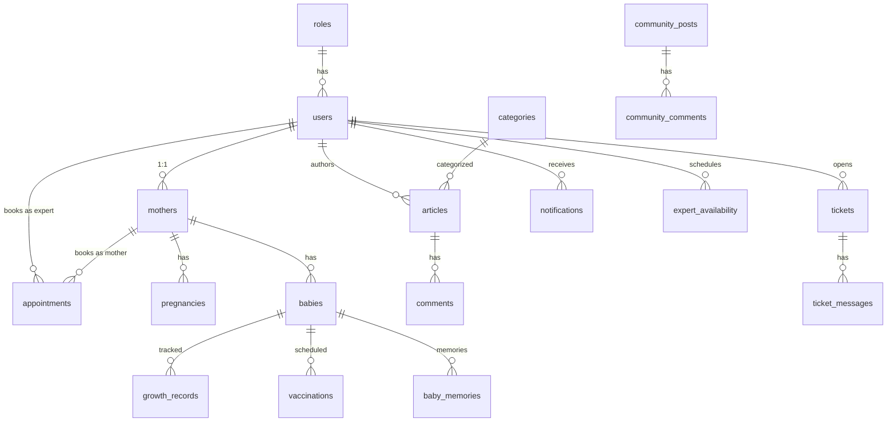
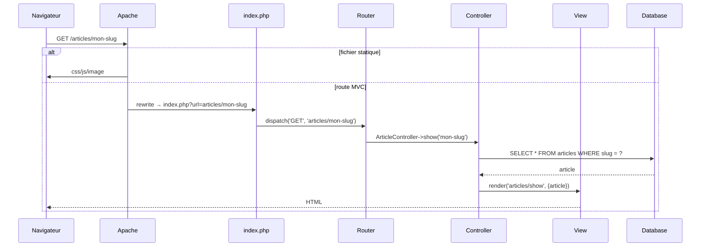

# LUMA — UML Architecture

> Application MVC PHP native. Routage maison, Repository, Middleware RBAC, templates layouts.

---

## 1. Diagrammes de Cas d'Utilisation

### 1.1 Visiteur (non connecté)

```mermaid
usecaseDiagram
  actor Visiteur as V

  V --> (Consulter page d'accueil)
  V --> (Lire articles)
  V --> (Consulter ressources)
  V --> (Voir annuaire experts)
  V --> (Consulter FAQ)
  V --> (S'abonner newsletter)
  V --> (Créer un compte)
  V --> (Se connecter)

  (Créer un compte) ..> (Valider email) : <<include>>
  (Créer un compte) ..> (Choisir rôle) : <<include>>
  (Se connecter) ..> (Valider identifiants) : <<include>>
  (Se connecter) ..> (Réinitialiser mot de passe) : <<extend>>
```

### 1.2 Maman

```mermaid
usecaseDiagram
  actor Maman as M

  M --> (Gérer profil grossesse)
  M --> (Suivre bébé)
  M --> (Prendre rendez-vous)
  M --> (Consulter messagerie)
  M --> (Créer ticket support)
  M --> (Donner témoignage)

  (Gérer profil grossesse) ..> (Renseigner date accouchement) : <<include>>
  (Gérer profil grossesse) ..> (Ajouter info médicale) : <<include>>

  (Suivre bébé) ..> (Ajouter mesure croissance) : <<include>>
  (Suivre bébé) ..> (Enregistrer vaccin) : <<include>>
  (Suivre bébé) ..> (Écrire souvenir) : <<extend>>

  (Prendre rendez-vous) ..> (Choisir expert) : <<include>>
  (Prendre rendez-vous) ..> (Choisir créneau) : <<include>>
  (Prendre rendez-vous) ..> (Annuler rendez-vous) : <<extend>>

  (Créer ticket support) ..> (Choisir catégorie) : <<include>>
  (Créer ticket support) ..> (Joindre fichier) : <<extend>>
```

### 1.3 Expert

```mermaid
usecaseDiagram
  actor Expert as E

  E --> (Gérer articles)
  E --> (Publier ressources)
  E --> (Gérer rendez-vous)
  E --> (Répondre communauté)
  E --> (Gérer tickets assignés)
  E --> (Consulter messagerie)

  (Gérer articles) ..> (Rédiger contenu) : <<include>>
  (Gérer articles) ..> (Choisir catégorie) : <<include>>
  (Gérer articles) ..> (Programmer publication) : <<extend>>

  (Gérer rendez-vous) ..> (Consulter agenda) : <<include>>
  (Gérer rendez-vous) ..> (Confirmer rendez-vous) : <<include>>
  (Gérer rendez-vous) ..> (Proposer nouveau créneau) : <<extend>>
```

### 1.4 CTT (Centre d'appel)

```mermaid
usecaseDiagram
  actor CTT as C

  C --> (Gérer tickets support)
  C --> (Gérer FAQ)
  C --> (Consulter rapports)

  (Gérer tickets support) ..> (Assigner ticket) : <<include>>
  (Gérer tickets support) ..> (Clôturer ticket) : <<include>>
  (Gérer tickets support) ..> (Escalader ticket) : <<extend>>

  (Gérer FAQ) ..> (Ajouter question) : <<include>>
  (Gérer FAQ) ..> (Modifier réponse) : <<include>>
```

### 1.5 Administrateur

```mermaid
usecaseDiagram
  actor Admin as A

  A --> (Gérer utilisateurs)
  A --> (Gérer articles & catégories)
  A --> (Modérer communauté)
  A --> (Gérer témoignages)
  A --> (Gérer tickets)
  A --> (Paramètres site)

  (Gérer utilisateurs) ..> (Consulter profil) : <<include>>
  (Gérer utilisateurs) ..> (Modifier rôle) : <<include>>
  (Gérer utilisateurs) ..> (Suspendre compte) : <<extend>>

  (Modérer communauté) ..> (Approuver contenu) : <<include>>
  (Modérer communauté) ..> (Masquer publication) : <<include>>
  (Modérer communauté) ..> (Bannir utilisateur) : <<extend>>

  (Gérer témoignages) ..> (Approuver) : <<include>>
  (Gérer témoignages) ..> (Rejeter) : <<include>>
```

### 1.6 Général — Hiérarchie des acteurs

```mermaid
usecaseDiagram
  actor Visiteur as V
  actor Membre as M
  actor Maman as MA
  actor Expert as E
  actor CTT as C
  actor Admin as A

  M --|> V
  MA --|> M
  E --|> M
  C --|> M
  A --|> M

  V --> (Consulter contenu public)
  V --> (S'authentifier)

  M --> (Gérer profil)
  M --> (Notifications)

  MA --> (Suivi maternité & rendez-vous)
  E --> (Contenus éditoriaux & agenda)
  C --> (Support client & FAQ)
  A --> (Administration & modération)
```

---

## 2. Diagramme de Classes

```mermaid
classDiagram

  class Router {
    +get(path, handler)
    +post(path, handler)
    +dispatch(method, url)
  }

  class Database {
    +getInstance()
    +getConnection()
  }

  class View {
    +render(view, data, layout)
  }

  class Session {
    +get(key)
    +set(key, value)
    +destroy()
    +csrf_token()
  }

  class Request {
    +method()
    +post(key)
    +get(key)
    +redirect(url)
  }

  class Validator {
    +required(field)
    +email(field)
    +passes()
    +errors()
  }

  class Model {
    +find(id)
    +all(criteria)
    +create(data)
    +update(id, data)
    +delete(id)
  }

  class AuthMiddleware {
    +check()
  }

  class GuestMiddleware {
    +check()
  }

  class RoleMiddleware {
    +check(roleSlug)
  }

  class AdminMiddleware {
    +check()
  }

  Controller <|-- AuthController
  Controller <|-- PageController
  Controller <|-- ArticleController
  Controller <|-- CommunityController
  Controller <|-- DashboardController
  Controller <|-- ExpertController
  Controller <|-- CttController
  Controller <|-- TicketController
  Controller <|-- AdminController
  Controller <|-- AdminUserController
  Controller <|-- AdminArticleController
  Controller <|-- AdminTicketController

  note for Controller "22 controlleurs au total\ntous héritent de Controller"

  BaseRepository <|-- UserRepository
  BaseRepository <|-- ArticleRepository
  BaseRepository <|-- TicketRepository
  BaseRepository <|-- AppointmentRepository
  BaseRepository <|-- MotherRepository
  BaseRepository <|-- BabyRepository
  BaseRepository <|-- NotificationRepository

  note for BaseRepository "19 repositories au total\n1 par table"

  class AuthService {
    +authenticate(email, password)
    +register(name, email, password)
  }

  class EmailService {
    +send(to, subject, body)
  }

  class TicketService {
    +createTicket(userId, subject)
    +assign(ticketId, expertId)
    +close(ticketId)
  }

  class AppointmentService {
    +book(motherId, expertId, date)
    +confirm(appointmentId)
    +cancel(appointmentId)
  }

  class NotificationService {
    +create(userId, type, title)
  }

  class CommunityService {
    +createPost(userId, title)
    +comment(postId, userId)
  }

  AuthController --> AuthService
  AuthController --> Validator

  DashboardController --> UserRepository
  DashboardController --> AppointmentRepository

  ExpertController --> AppointmentRepository
  ExpertController --> AvailabilityRepository

  CttController --> TicketRepository

  AppointmentService --> EmailService
  AppointmentService --> NotificationService
  TicketService --> EmailService
  TicketService --> NotificationService

  AuthService --> UserRepository
  EmailService --> UserRepository
  AppointmentService --> AppointmentRepository
  TicketService --> TicketRepository

  View <-- Controller
  Session <-- Controller
  Session <-- AuthMiddleware
  Request <-- Controller
  Request <-- AuthMiddleware
  Database <-- BaseRepository
  Database <-- Model

  class ArticleStatus {
    <<enum>>
    DRAFT, PUBLISHED
  }

  class UserStatus {
    <<enum>>
    ACTIVE, SUSPENDED, BANNED
  }

  class AppointmentStatus {
    <<enum>>
    PENDING, CONFIRMED, CANCELLED
  }

  class TicketStatus {
    <<enum>>
    OPEN, IN_PROGRESS, CLOSED
  }

  class CommentStatus {
    <<enum>>
    PENDING, APPROVED, REJECTED
  }

  note for ArticleStatus "13 enums au total"
```



---

## 3. Diagrammes de Séquence

### 3.1 Authentification



### 3.2 Prise de Rendez-vous



### 3.3 Création d'Article



---

## 4. Architecture Package



---

## 5. Base de Données (31 tables)



---

## 6. Flux de Requête MVC


