# LUMA — UML Architecture

> Application MVC PHP native. Routage maison, Repository, Middleware RBAC, templates layouts.

---

## 1. Diagrammes de Cas d'Utilisation

### 1.1 Visiteur (non connecté)

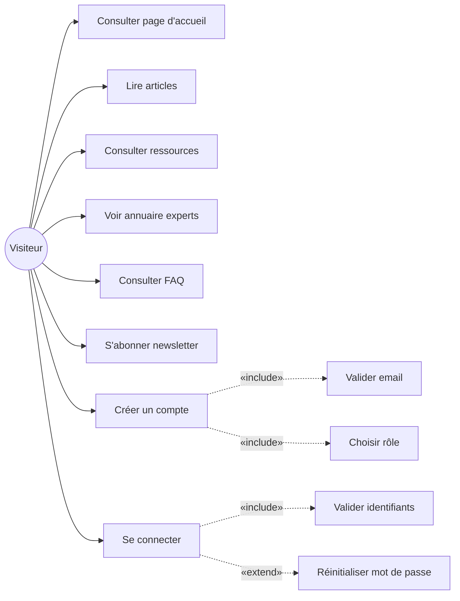

### 1.2 Maman

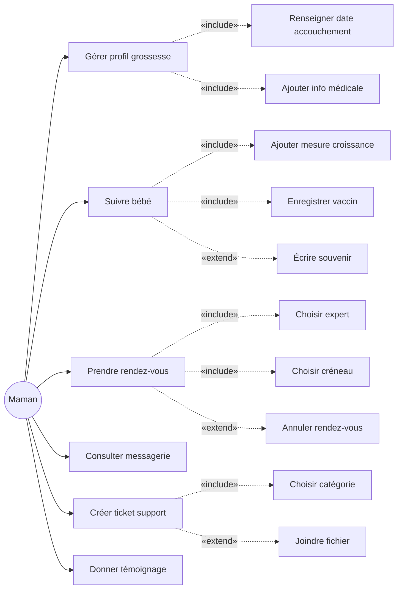

### 1.3 Expert

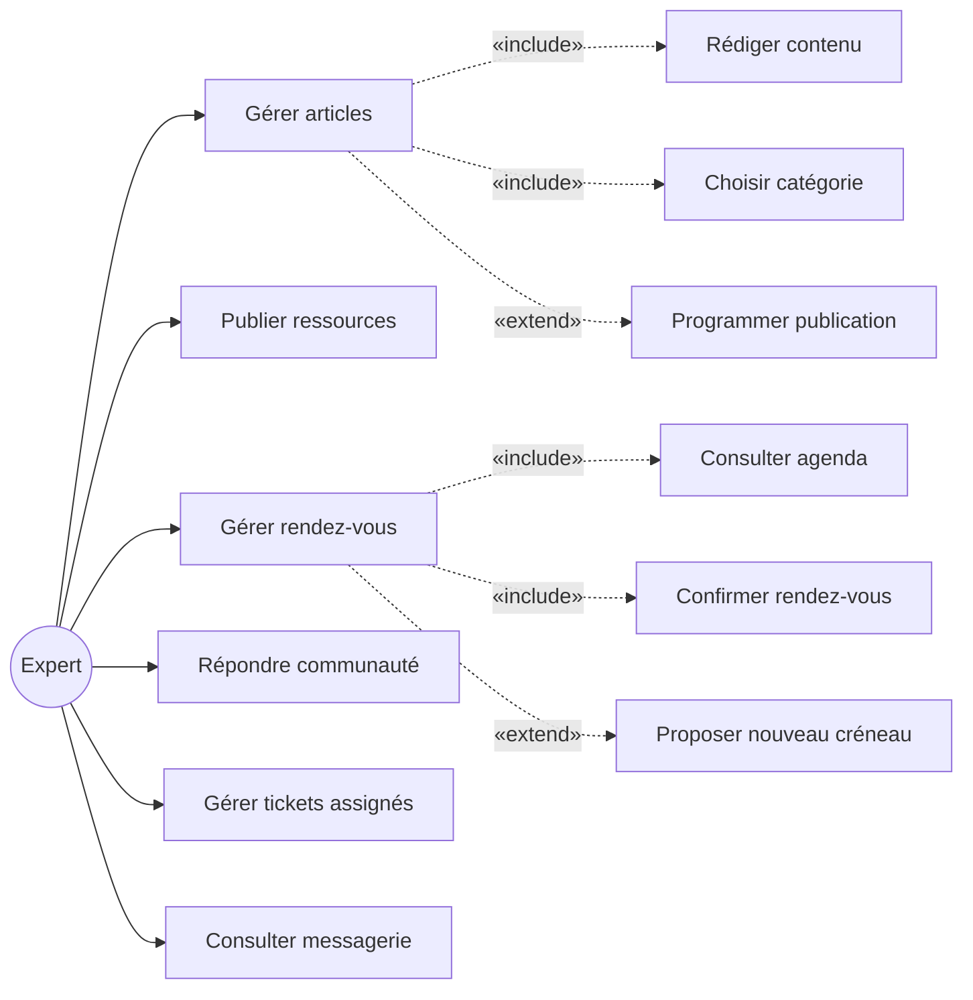

### 1.4 CTT (Centre d'appel)

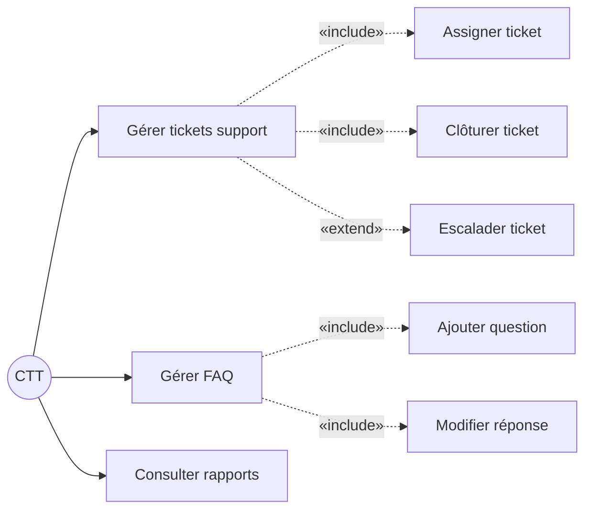

### 1.5 Administrateur

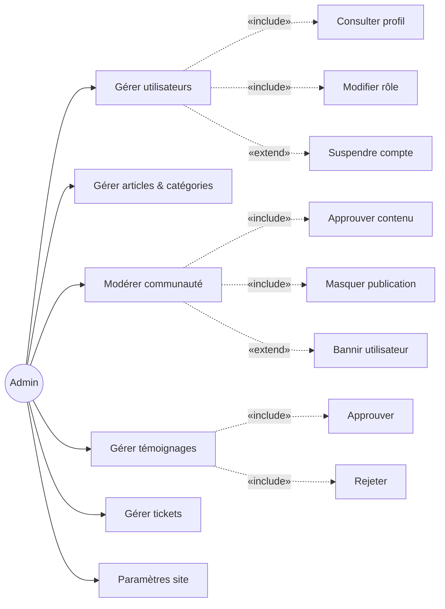

### 1.6 Général — Hiérarchie des acteurs

```mermaid
graph TB
  V((Visiteur))
  M((Membre))
  MA((Maman))
  E((Expert))
  CTT((CTT))
  A((Admin))

  M --|> V
  MA --|> M
  E --|> M
  CTT --|> M
  A --|> M

  V --> Pub[Consulter contenu public]
  V --> Auth[S'authentifier]

  M --> Profil[Gérer profil]
  M --> Notif[Notifications]

  MA --> M1[Suivi maternité & rendez-vous]
  E --> E1[Contenus éditoriaux & agenda]
  CTT --> C1[Support client & FAQ]
  A --> AD[Administration & modération]
```

---

## 2. Diagramme de Classes


---

## 3. Diagrammes de Séquence

### 3.1 Authentification

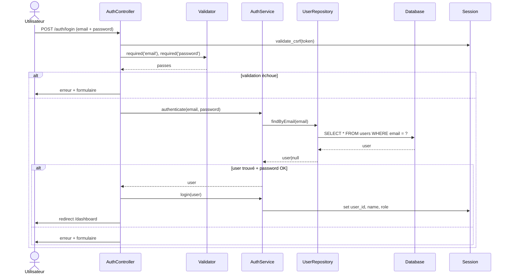

### 3.2 Prise de Rendez-vous

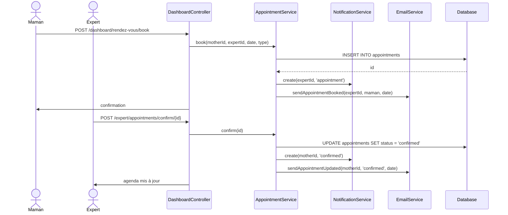

### 3.3 Création d'Article

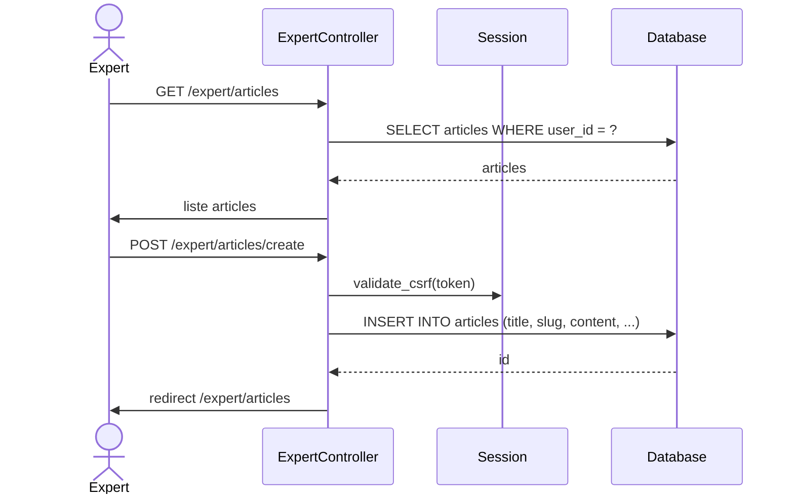

---

## 4. Architecture Package

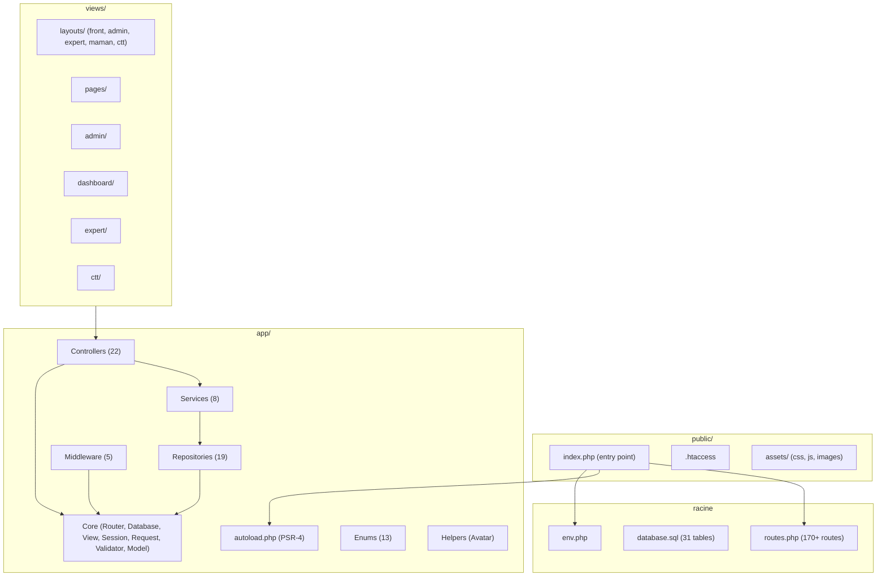

---

## 5. Base de Données (31 tables)

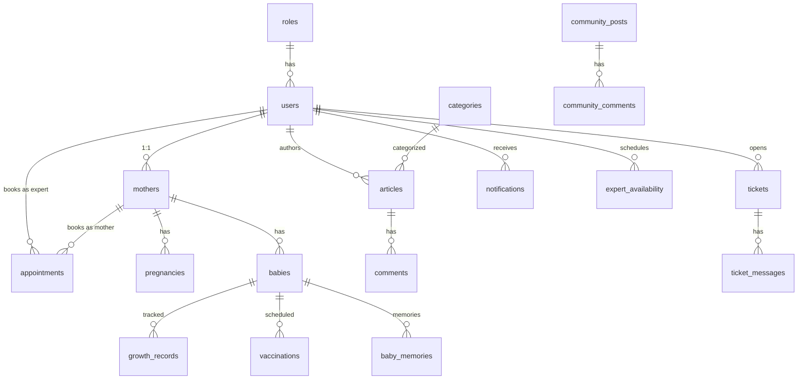

---

## 6. Flux de Requête MVC

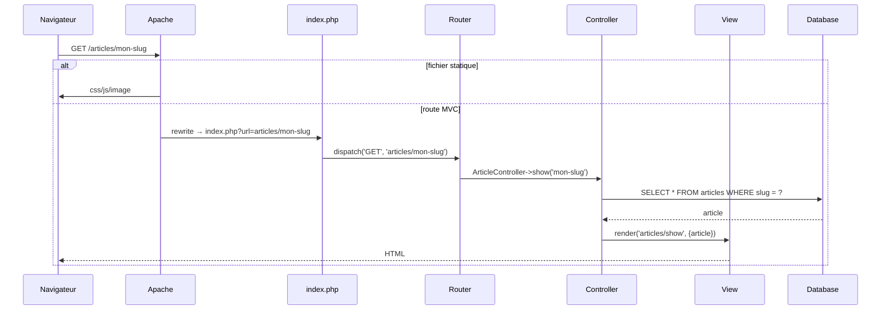
