# LUMA — UML Architecture

> Application MVC PHP native. Routage maison, Repository, Middleware RBAC, templates layouts.

---

## 1. Diagrammes de Cas d'Utilisation

### 1.1 Par Rôle

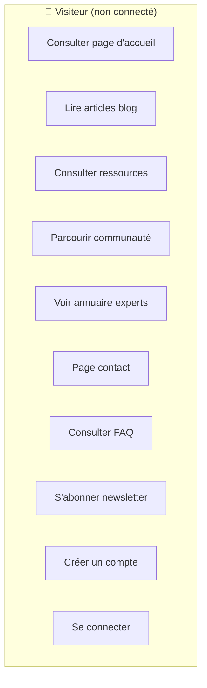

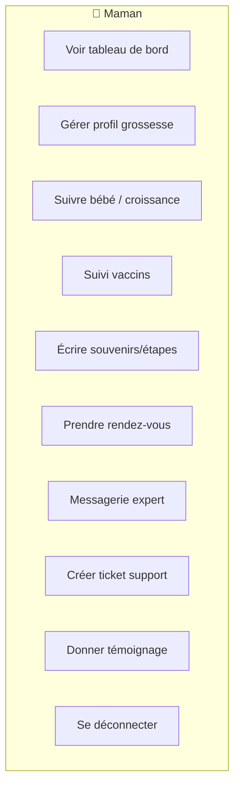

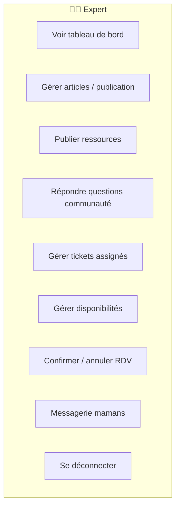

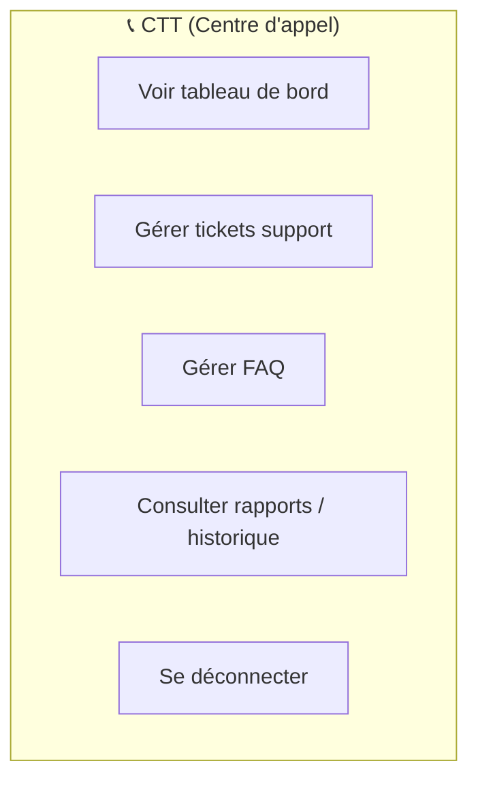

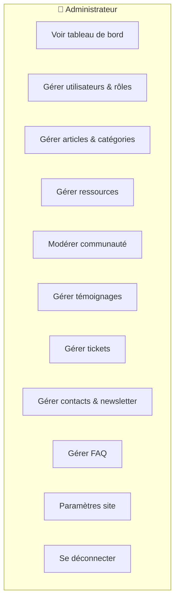

### 1.2 Général (Tous rôles)

```mermaid
graph TB
  subgraph PLATEFORME["Plateforme LUMA"]
    direction TB

    subgraph Public["Publique"]
      V1[Consulter accueil]
      V2[Lire articles / ressources]
      V3[Voir FAQ / Contact]
      V4[Annuaire experts]
      V5[S'abonner newsletter]
      V6[Créer compte / Connexion]
    end

    subgraph Maman["Espace Maman"]
      M1[Tableau de bord]
      M2[Suivi grossesse / bébé]
      M3[Rendez-vous & messagerie]
      M4[Tickets & témoignages]
    end

    subgraph Expert["Espace Expert"]
      E1[Tableau de bord]
      E2[Articles & ressources]
      E3[Agenda & messagerie]
      E4[Tickets & communauté]
    end

    subgraph CTT["Espace CTT"]
      C1[Tableau de bord]
      C2[Tickets & FAQ]
      C3[Rapports]
    end

    subgraph Admin["Espace Admin"]
      A1[Tableau de bord]
      A2[Gestion complète]
      A3[Paramètres & modération]
    end
  end

  V1 --> Public
  V2 --> Public

  M1 --> Maman
  M2 --> Maman

  E1 --> Expert
  E2 --> Expert

  C1 --> CTT

  A1 --> Admin
  A2 --> Admin
```

---

## 2. Diagramme de Classes

---

## 3. Diagrammes de Séquence

### 3.1 Authentification

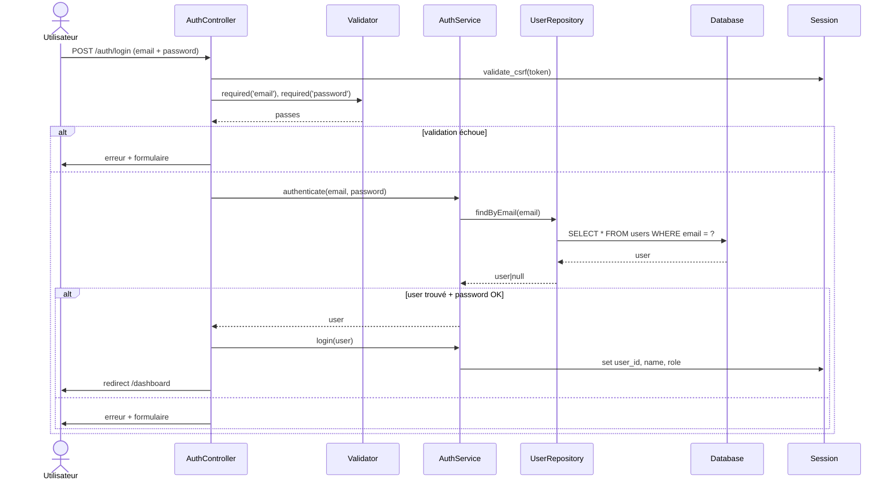

### 3.2 Prise de Rendez-vous

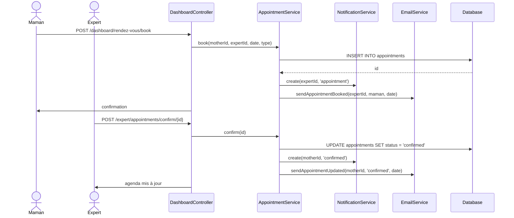

### 3.3 Création d'Article

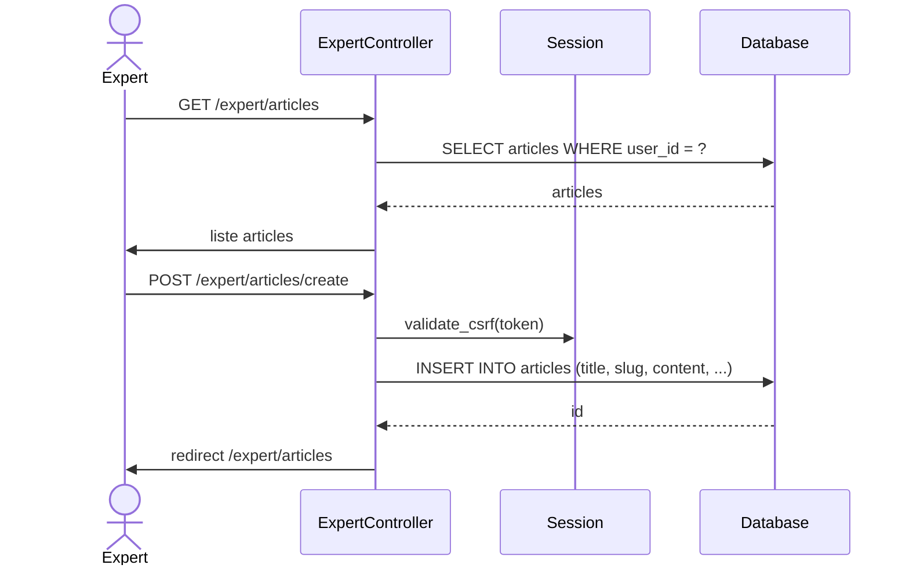

---

## 4. Architecture Package

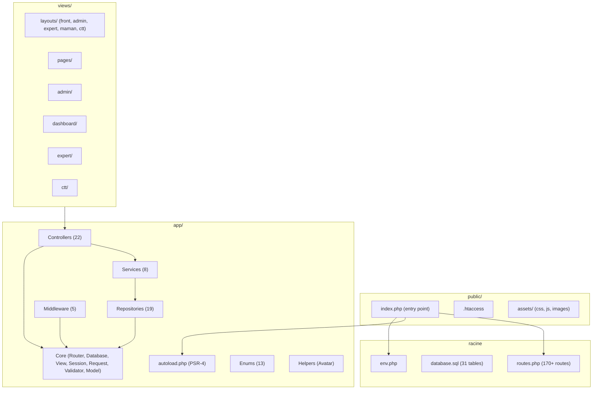

---

## 5. Base de Données (31 tables)

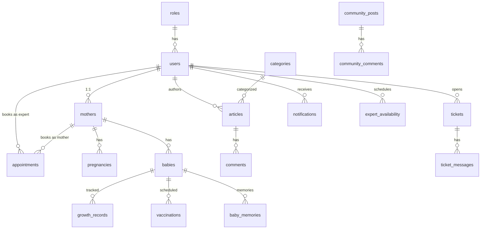

---

## 6. Flux de Requête MVC

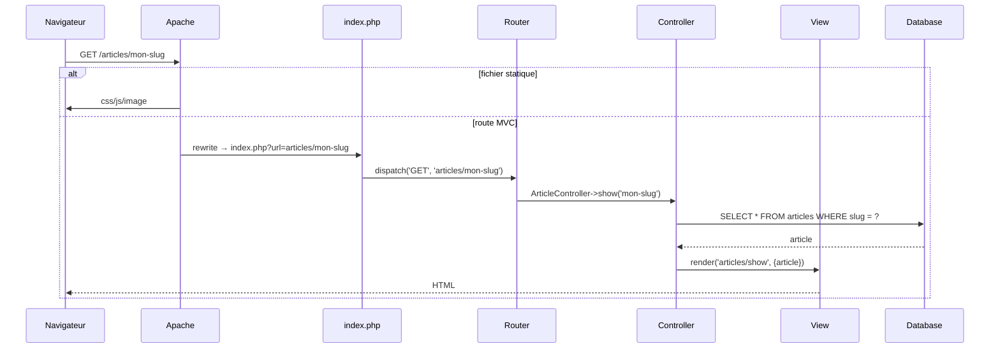
