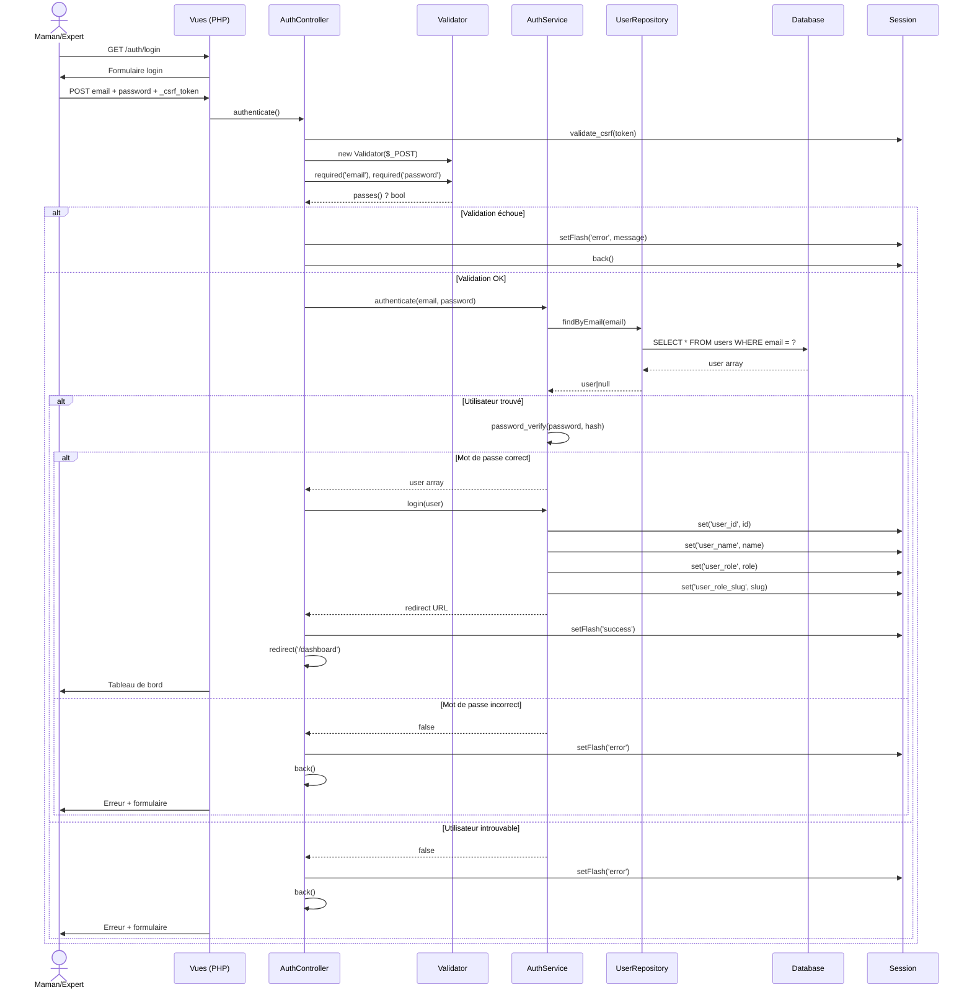
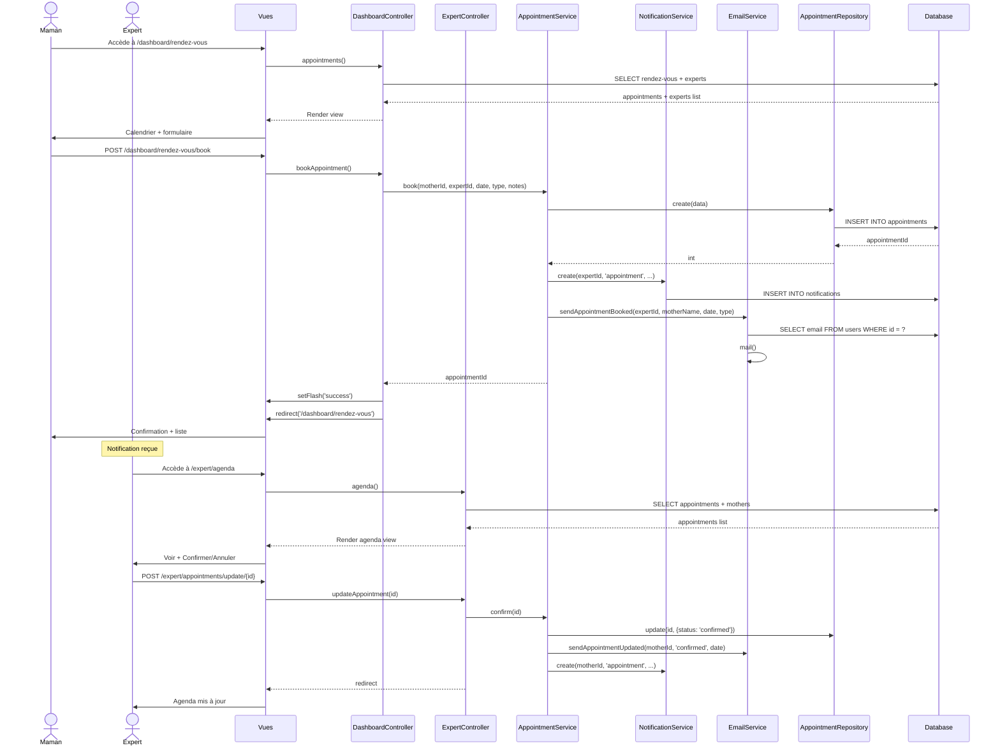
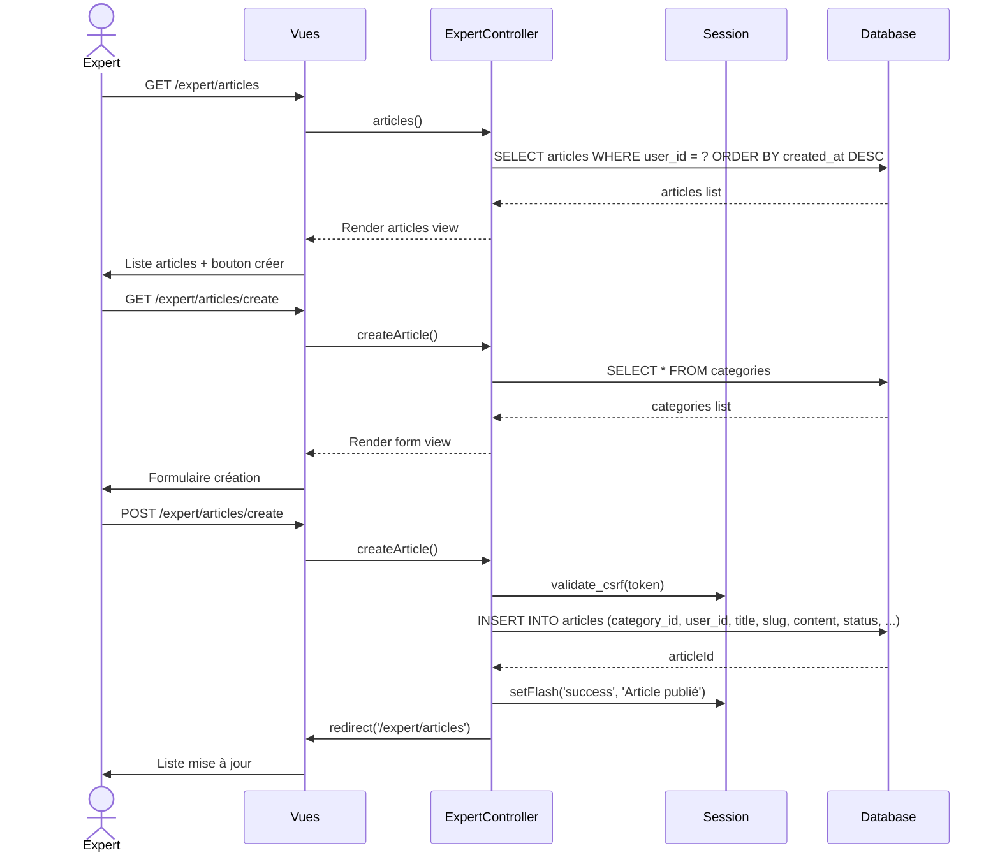
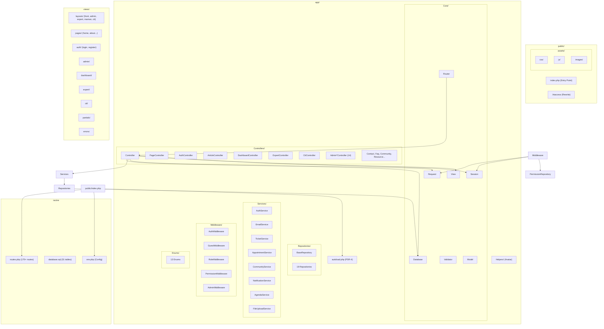
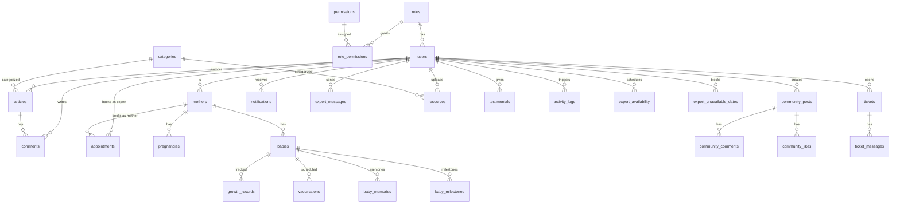
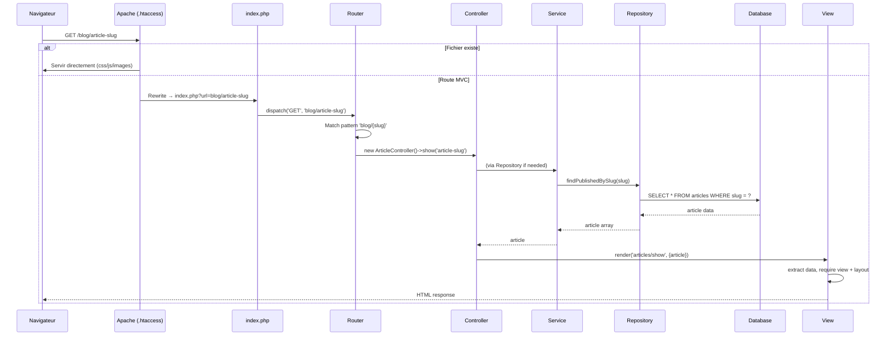

# LUMA — UML Architecture

> Application MVC PHP native (sans framework). Architecture modulaire avec routage
> maison, couche Repository, Middleware RBAC, et système de templates par layouts.

---

## 1. Diagramme de Cas d'Utilisation

```mermaid
graph TB
  subgraph LUMA["Plateforme LUMA"]
    direction TB

    subgraph Public["Publique (sans auth)"]
      H[Consulter accueil]
      B[Lire articles blog]
      R[Voir ressources]
      C[Parcourir communauté]
      E[Voir annuaire experts]
      CT[Page contact]
      F[Consulter FAQ]
      N[S'abonner newsletter]
    end

    subgraph Auth["Authentification"]
      REG[Créer un compte]
      LOG[Se connecter]
      LOGOUT[Se déconnecter]
    end

    subgraph Maman["Espace Maman"]
      MP[Gérer profil grossesse]
      MB[Suivre bébé / croissance]
      MV[Suivi vaccins]
      MM[Écrire souvenirs/étapes]
      MA[Prendre rendez-vous]
      MMSG[Messagerie expert]
      MT[Créer ticket support]
      MTM[Témoignage]
      MD[Voir tableau de bord]
    end

    subgraph Expert["Espace Expert"]
      EA[Gérer articles]
      ER[Publier ressources]
      EQ[Répondre questions communauté]
      ET[Gérer tickets assignés]
      EDISP[Gérer disponibilités]
      EAP[Confirmer/annuler RDV]
      EMSG[Messagerie mamans]
    end

    subgraph CTT["Espace CTT"]
      TT[Gérer tickets support]
      TF[Gérer FAQ]
      TR[Voir rapports & historique]
    end

    subgraph Admin["Espace Admin"]
      AU[Gérer utilisateurs & rôles]
      AA[Gérer articles & catégories]
      AR[Gérer ressources]
      ACO[Modérer communauté]
      AT[Gérer témoignages]
      ATK[Gérer tickets]
      ACNT[Gérer contacts/newsletter]
      AFAQ[Gérer FAQ]
      AS[Paramètres site]
    end
  end

  Guest((Visiteur)) --> H
  Guest --> B
  Guest --> R
  Guest --> C
  Guest --> E
  Guest --> CT
  Guest --> F
  Guest --> N
  Guest --> REG
  Guest --> LOG

  Maman((Maman)) --> LOGOUT
  Maman --> MP
  Maman --> MB
  Maman --> MV
  Maman --> MM
  Maman --> MA
  Maman --> MMSG
  Maman --> MT
  Maman --> MTM
  Maman --> MD
  Maman --> B
  Maman --> R
  Maman --> C

  Expert((Expert)) --> LOGOUT
  Expert --> EA
  Expert --> ER
  Expert --> EQ
  Expert --> ET
  Expert --> EDISP
  Expert --> EAP
  Expert --> EMSG

  CTT((CTT)) --> LOGOUT
  CTT --> TT
  CTT --> TF
  CTT --> TR

  Admin((Admin)) --> LOGOUT
  Admin --> AU
  Admin --> AA
  Admin --> AR
  Admin --> ACO
  Admin --> AT
  Admin --> ATK
  Admin --> ACNT
  Admin --> AFAQ
  Admin --> AS
```

---

## 2. Diagramme de Classes

```mermaid
classDiagram

  %% ==================== CORE ====================
  class Router {
    -routes array
    +get(path, handler) void
    +post(path, handler) void
    +dispatch(method, url) void
  }

  class Database {
    -instance Database|null
    -pdo PDO
    +getInstance() Database
    +getConnection() PDO
    +query(sql, params) Statement
    +fetch(sql, params) array|null
    +fetchAll(sql, params) array
    +insert(sql, params) int
  }

  class View {
    +render(view, data, layout) void
    +renderPartial(view, data) void
  }

  class Session {
    +start() void
    +set(key, value) void
    +get(key, default) mixed
    +has(key) bool
    +remove(key) void
    +destroy() void
    +csrf_token() string
    +csrf_field() string
    +validate_csrf(token) void
    +setFlash(key, value) void
    +getFlash(key, default) mixed
  }

  class Request {
    +method() string
    +post(key, default) mixed
    +get(key, default) mixed
    +file(key) array|null
    +all() array
    +isPost() bool
    +redirect(url) void
    +back() void
  }

  class Validator {
    -errors array
    -data array
    +required(field, label) Validator
    +email(field, label) Validator
    +minLength(field, min, label) Validator
    +maxLength(field, max, label) Validator
    +numeric(field, label) Validator
    +inArray(field, allowed, label) Validator
    +matches(field, other) Validator
    +passes() bool
    +errors() array
    +firstError() string
  }

  class Model {
    #db Database
    #table string
    #primaryKey string
    +find(id) array|null
    +all(criteria, orderBy) array
    +create(data) int
    +update(id, data) void
    +delete(id) void
    +count(criteria) int
    +raw(sql, params) array
    +rawOne(sql, params) array|null
    +execute(sql, params) void
  }

  %% ==================== MIDDLEWARE ====================
  class AuthMiddleware {
    +check() void
  }

  class GuestMiddleware {
    +check() void
  }

  class RoleMiddleware {
    +check(roleSlug) void
  }

  class PermissionMiddleware {
    +check(permissionSlug) void
  }

  class AdminMiddleware {
    +check() void
  }

  %% ==================== CONTROLLERS ====================
  class Controller {
    #layout string
    #render(view, data) void
    #authCheck() void
  }

  class PageController {
    +home() void
    +about() void
  }

  class AuthController {
    -authService AuthService
    +login() void
    +authenticate() void
    +register() void
    +store() void
    +logout() void
  }

  class ArticleController {
    +index() void
    +show(slug) void
    +comment(slug) void
  }

  class ResourceController {
    +index() void
    +show(slug) void
  }

  class CommunityController {
    +index() void
    +store() void
    +show(id) void
    +comment(id) void
    +like(id) void
    +deleteComment(id) void
  }

  class ContactController {
    +index() void
    +store() void
  }

  class FaqController {
    +index() void
  }

  class NewsletterController {
    +subscribe() void
    +unsubscribe() void
  }

  class DashboardController {
    +index() void
    +profil() void
    +updateProfil() void
    +grossesse() void
    +updateGrossesse() void
    +completePregnancy() void
    +bebe() void
    +updateBebe() void
    +croissance() void
    +addCroissance() void
    +deleteCroissance(id) void
    +vaccination() void
    +addVaccination() void
    +deleteVaccination(id) void
    +tickets() void
    +createTicket() void
    +notifications() void
    +readAllNotifications() void
    +readNotification(id) void
    +parametres() void
    +updateParametres() void
    +memories() void
    +updateMemory(id) void
    +deleteMemory(id) void
    +updateMilestones() void
    +appointments() void
    +bookAppointment() void
    +messages() void
    +sendMessage() void
    +agenda() void
    +testimonials() void
    +submitTestimonial() void
    +cancelAppointment(id) void
  }

  class ExpertController {
    +directory() void
    +showProfile(id) void
    +parametres() void
    +updateParametres() void
    +index() void
    +profil() void
    +updateProfil() void
    +questions() void
    +answerQuestion(id) void
    +articles() void
    +createArticle() void
    +editArticle(id) void
    +updateArticle(id) void
    +deleteArticle(id) void
    +ressources() void
    +createResource() void
    +editResource(id) void
    +updateResource(id) void
    +deleteResource(id) void
    +messages() void
    +sendMessage() void
    +notifications() void
    +readAllNotifications() void
    +readNotification(id) void
    +agenda() void
    +updateAppointment(id) void
    +availability() void
    +saveAvailability() void
    +addUnavailableDate() void
    +removeUnavailableDate(date) void
    +availableSlots(id) void
  }

  class CttController {
    +index() void
    +tickets() void
    +updateTicket(id) void
    +assignTicket(id) void
    +faq() void
    +createFaq() void
    +deleteFaq(id) void
    +historique() void
    +rapports() void
    +notifications() void
    +readAllNotifications() void
    +readNotification(id) void
    +respondTicket(id) void
  }

  class AdminController {
    +index() void
  }

  class AdminUserController {
    +index() void
    +store() void
    +toggleRole(id) void
    +suspend(id) void
    +activate(id) void
    +destroy(id) void
  }

  class AdminArticleController {
    +index() void
    +create() void
    +store() void
    +edit(id) void
    +update(id) void
    +destroy(id) void
  }

  class AdminCategoryController {
    +index() void
    +edit(id) void
    +update(id) void
    +store() void
    +destroy(id) void
  }

  class AdminResourceController {
    +index() void
    +create() void
    +store() void
    +edit(id) void
    +update(id) void
    +destroy(id) void
  }

  class AdminTicketController {
    +index() void
    +assign(id) void
    +close(id) void
    +destroy(id) void
    +reply(id) void
    +show(id) void
  }

  class AdminCommentController {
    +index() void
    +approve(id) void
    +reject(id) void
    +destroy(id) void
  }

  class AdminCommunityController {
    +index() void
    +hide(id) void
    +destroy(id) void
  }

  class AdminTestimonialController {
    +index() void
    +approve(id) void
    +reject(id) void
    +destroy(id) void
  }

  class AdminFaqController {
    +index() void
    +store() void
    +edit(id) void
    +update(id) void
    +destroy(id) void
  }

  class AdminContactController {
    +index() void
    +markRead(id) void
    +destroy(id) void
  }

  class AdminNewsletterController {
    +index() void
    +destroy(id) void
  }

  class AdminMotherController {
    +index() void
    +show(id) void
  }

  class AdminExpertController {
    +index() void
    +validate(id) void
    +destroy(id) void
  }

  class AdminSettingsController {
    +index() void
    +update() void
  }

  class NotificationController {
    +markAsRead(id) void
    +markAllAsRead() void
  }

  class TicketController {
    +index() void
    +show(id) void
    +reply(id) void
  }

  %% ==================== REPOSITORIES ====================
  class BaseRepository {
    #db Database
    #table string
    #primaryKey string
    +findById(id) array|null
    +findAll(criteria, orderBy, limit) array
    +create(data) int
    +update(id, data) void
    +delete(id) void
    +count(criteria) int
    +exists(id) bool
    +paginate(page, perPage, criteria, orderBy) array
    +raw(sql, params) array
    +rawOne(sql, params) array|null
    +execute(sql, params) void
  }

  class UserRepository
  class ArticleRepository
  class CategoryRepository
  class CommentRepository
  class ResourceRepository
  class CommunityPostRepository
  class TicketRepository
  class AppointmentRepository
  class MotherRepository
  class BabyRepository
  class PregnancyRepository
  class NotificationRepository
  class PermissionRepository
  class FaqRepository
  class ContactRepository
  class NewsletterRepository
  class TestimonialRepository
  class AvailabilityRepository

  %% ==================== SERVICES ====================
  class AuthService {
    +authenticate(email, password) array|false
    +register(name, email, password, phone) int|false
    +login(user) void
    +getRedirectUrl(roleSlug) string
  }

  class EmailService {
    -fromEmail string
    -fromName string
    -userRepo UserRepository
    +send(to, subject, htmlBody) bool
    +sendAppointmentBooked(expertId, motherName, date, type) void
    +sendAppointmentUpdated(motherUserId, action, date) void
    +sendTicketAssigned(expertId, ticketId, subject) void
    +sendTicketReplied(creatorId, ticketId) void
    +sendTicketClosed(creatorId, ticketId) void
    +sendNewMessage(receiverId, senderName) void
    +sendExpertValidated(expertId, expertName) void
  }

  class TicketService {
    +createTicket(userId, subject, message, priority) int
    +reply(ticketId, userId, message) void
    +assign(ticketId, expertId) void
    +close(ticketId) void
  }

  class AppointmentService {
    +book(motherId, expertId, date, type, notes) int
    +confirm(appointmentId) void
    +cancel(appointmentId) void
  }

  class CommunityService {
    +createPost(userId, title, content) int
    +comment(postId, userId, content) int
    +like(postId, userId) void
    +unlike(postId, userId) void
  }

  class NotificationService {
    +create(userId, type, title, message, link) void
    +markAsRead(notificationId) void
    +markAllAsRead(userId) void
  }

  class AgendaService {
    +getEvents(userId, startDate, endDate) array
  }

  class FileUploadService {
    +upload(file, directory) string|false
    +delete(filePath) bool
  }

  %% ==================== ENUMS ====================
  class ArticleStatus {
    <<enumeration>>
    DRAFT
    PUBLISHED
  }

  class UserStatus {
    <<enumeration>>
    ACTIVE
    SUSPENDED
    BANNED
  }

  class AppointmentStatus {
    <<enumeration>>
    PENDING
    CONFIRMED
    CANCELLED
  }

  class AppointmentType {
    <<enumeration>>
    ONLINE
    IN_PERSON
  }

  class TicketStatus {
    <<enumeration>>
    OPEN
    IN_PROGRESS
    CLOSED
  }

  class TicketPriority {
    <<enumeration>>
    LOW
    MEDIUM
    HIGH
    URGENT
  }

  class CommentStatus {
    <<enumeration>>
    PENDING
    APPROVED
    REJECTED
  }

  class PostStatus {
    <<enumeration>>
    PUBLISHED
    HIDDEN
    REPORTED
  }

  class PregnancyStatus {
    <<enumeration>>
    ACTIVE
    COMPLETED
  }

  class VaccinationStatus {
    <<enumeration>>
    PENDING
    DONE
    MISSED
  }

  class ResourceType {
    <<enumeration>>
    PDF
    EBOOK
    VIDEO
    GUIDE
  }

  class TestimonialStatus {
    <<enumeration>>
    PENDING
    APPROVED
    REJECTED
  }

  class NotificationType {
    <<enumeration>>
    WELCOME
    APPOINTMENT
    MESSAGE
    TICKET
    SYSTEM
  }

  %% ==================== HELPERS ====================
  class Avatar {
    +generate(name) string
    +url(path) string
  }

  %% ==================== RELATIONS ====================

  %% Controller inheritance
  Controller <|-- AuthController
  Controller <|-- DashboardController
  Controller <|-- ArticleController
  Controller <|-- ResourceController
  Controller <|-- CommunityController
  Controller <|-- ContactController
  Controller <|-- FaqController
  Controller <|-- NewsletterController
  Controller <|-- CttController
  Controller <|-- TicketController
  Controller <|-- AdminArticleController
  Controller <|-- AdminCategoryController
  Controller <|-- AdminUserController
  Controller <|-- AdminResourceController
  Controller <|-- AdminTicketController
  Controller <|-- AdminCommentController
  Controller <|-- AdminCommunityController
  Controller <|-- AdminTestimonialController
  Controller <|-- AdminFaqController
  Controller <|-- AdminContactController
  Controller <|-- AdminNewsletterController
  Controller <|-- AdminMotherController
  Controller <|-- AdminExpertController
  Controller <|-- AdminSettingsController
  Controller <|-- AdminController

  %% Repository inheritance
  BaseRepository <|-- UserRepository
  BaseRepository <|-- ArticleRepository
  BaseRepository <|-- CategoryRepository
  BaseRepository <|-- CommentRepository
  BaseRepository <|-- ResourceRepository
  BaseRepository <|-- CommunityPostRepository
  BaseRepository <|-- TicketRepository
  BaseRepository <|-- AppointmentRepository
  BaseRepository <|-- MotherRepository
  BaseRepository <|-- BabyRepository
  BaseRepository <|-- PregnancyRepository
  BaseRepository <|-- NotificationRepository
  BaseRepository <|-- PermissionRepository
  BaseRepository <|-- FaqRepository
  BaseRepository <|-- ContactRepository
  BaseRepository <|-- NewsletterRepository
  BaseRepository <|-- TestimonialRepository
  BaseRepository <|-- AvailabilityRepository

  %% Controller uses Service
  AuthController --> AuthService
  AuthController --> Validator

  %% Controller uses Database directly (some)
  PageController --> Database

  %% Controller uses Repository
  DashboardController --> UserRepository
  DashboardController --> MotherRepository
  DashboardController --> BabyRepository
  DashboardController --> AppointmentRepository

  ExpertController --> AppointmentRepository
  ExpertController --> AvailabilityRepository

  CttController --> TicketRepository
  CttController --> FaqRepository

  %% Middleware relationships
  AdminMiddleware --> PermissionMiddleware

  %% Services uses Services
  AppointmentService --> EmailService
  AppointmentService --> NotificationService
  TicketService --> EmailService
  TicketService --> NotificationService

  %% Services uses Repositories
  AuthService --> UserRepository
  EmailService --> UserRepository
  TicketService --> TicketRepository
  AppointmentService --> AppointmentRepository
  AppointmentService --> UserRepository
  CommunityService --> CommunityPostRepository

  %% Core used by all
  View <-- Controller
  Session <-- Controller
  Session <-- Middleware
  Request <-- Middleware
  Request <-- Controller
  Database <-- BaseRepository
  Database <-- Model
```

---

## 3. Diagrammes de Séquence

### 3.1 Authentification (Connexion)

### 3.2 Prise de Rendez-vous (Maman → Expert)

### 3.3 Création d'Article (Expert)

---

## 4. Architecture Package

---

## 5. Base de Données (31 tables)

---

## 6. Flux de Requête MVC

